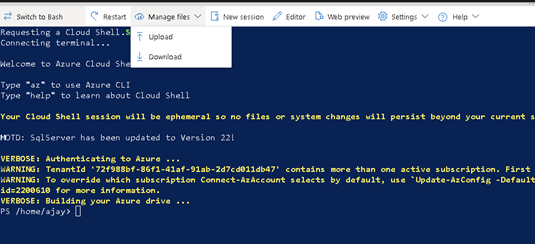

# Private preview to Enable Movement of VMs across zones during zonal outage

Virtual machines can be recovered quickly from zonal outages by moving them across availability zones. This solution guarantees a Recovery Point Objective (RPO) of zero and a minimal Recovery Time Objective (RTO) in minutes. By using [zone redundant disks](https://learn.microsoft.com/en-us/azure/virtual-machines/disks-redundancy#zone-redundant-storage-for-managed-disks) we will are able to provide an RPO of 0. As the feature is dependent on zone redundant disks all its [limitation](https://learn.microsoft.com/en-us/azure/virtual-machines/disks-redundancy#limitations) will apply to the recovery solution as well.

**NOTE: This feature should not be used for production workloads until General Availability (GA). Microsoft Privacy Statement: https://privacy.microsoft.com/en-us/privacystatement**

## Sign up for preview

Sign-up for the preview via this [form](https://forms.office.com/r/hDYGc0gXwT).
You will receive an email notification once you are enrolled for the preview.It takes ~4 business days to complete the process.


## Provide feedback 
Please fill up this [feedback form](https://aka.ms/ZRVMPreviewFeedbackForm) as you try out the preview. This will help us determine the pain points that can be overcome as we launch the next releases.

## Get started
In this private preview customers will be able to move the existing/new virtual machine that meet the prerequisites across availability zone.

## Supported configurations
- **Regions supported:** All azure production regions that support availability zones. For a list of these regions, see [Azure regions list](https://learn.microsoft.com/en-us/azure/reliability/regions-list#azure-regions-list-1).
- New VM must be deployed to a specific availability zone.
- API version: **2025-04-01**
- Ensure that the VM has the tag “useNRPDeallocateOnFabricFailure: true”. The tag is crucial as you will not be able to move the VM across zones without this tag on the virtual machine.
- Data disk (if used) should be Zone redundant disks data disks (premium/standard).
- OS disks should be Zone redundant (premium/standard) disks.
- Private IP Static/Dynamic can be used.
- Public IP if used should have standard SKU and must be zone redundant.
- Load Balancer and Gateway should be of standard SKU and zone redundant.
- Supported only via Rest API. We have provided scripts to test the feature easily. 

## Known limitations 
- Azure Site Recovery is not supported. This will be supported in future milestones.
- On-demand capacity reservation if enabled is not supported.This will be supported in future milestones.
- VMs having Data disks with write-accelerated enabled are not supported.
## Testing the feature via PS script
1.	Open the Cloud shell (PowerShell) from portal. Direct link -> https://shell.azure.com/ 
2.	Uploading the script that orchestrates enablement of the feature on the VM and moving the VM across zones.
   
      a.	Upload the script [Change-VMZone.ps1](./Change-VMZone.ps1) [Enable-VMZoneMovement.ps1](./Enable-VMZoneMovement.ps1) to cloud shell by navigating to Manage files -> Upload.

  	
  	
      b.	Optionally you can copy the scripts content on a new file using editors.
   
4.	To enable the VM with the zoneMovement feature use the below command:
      `.\Enable-VMZoneMovement.ps1 -subscriptionId {subscriptionId} -resourceGroupName {resourceGroupName} -vmName {vmName}`
  	This command will enable the feature like below
  	

6.	To move the VM across zone issue the below command on the CloudShell interface from portal.
   
     `.\Change-VMZone.ps1 -subscriptionId {subscriptionId} -resourceGroupName {resourceGroupName} -vmName {vmName} -targetZone {1 or 2 or 3}`

  	   Or
  	
  	   `.\Change-VMZone.ps1 -subscriptionId {subscriptionId} -resourceGroupName {resourceGroupName} -vmName {vmName} -targetZone {1 or 2 or 3} -authMode 'DeviceAuthentication'`

| Parameter | Description |
| --- | --- |
|SubscriptionId | Virtual machine subscription ID.|
|ResourceGroupName|Virtual machine resource group.|
|vmName|Virtual machine name.|
|targetZone|New availability zone for virtual machine.|

6.	Expected behaviour – 
The script enables the Zone movement feature on the VM mentioned in Step 5. The script then performs the move. You can refresh the overview blade in the portal for the virtual machine, you would see the VM state change from running to deallocating to deallocated. Within few minutes the VM state will be set to running and the availability zone would be the targetZone provided in the command.

## Testing via API Commands
### Create a VM via API
Please follow the below steps in order. The feature will work only for new VMs. Existing VMs will be supported in later milestones.  

1.	Create a VM in the subscription you have signed up for this preview.
2. Use any of these [examples](https://learn.microsoft.com/en-us/rest/api/compute/virtual-machines/create-or-update?view=rest-compute-2025-04-01&tabs=HTTP#examples) to create a VM. Make sure to:
   - Use zone redundant storage (ZRS) disks for both OS and data disks. Please see the documentation [here](https://learn.microsoft.com/en-us/azure/virtual-machines/disks-migrate-lrs-zrs?tabs=azure-portal) to migrate an existing LRS disk to ZRS.
3. Create a tag `useNRPDeallocateOnFabricFailure: true`. This is crucial as the VM cannot be moved across zones without the tag.
4. Review and create the VM successfully along with the tag.   
5.	Issue a PATCH VM call on the VM created in the above step.
```http
PUT https://management.azure.com/subscriptions/{subscriptionId}/resourceGroups/{resourceGroupName}/providers/Microsoft.Compute/virtualMachines/{vmName}?api-version=2025-04-01  
```
##### Request Body
```json
{
  "location": "westeurope",
  "properties": {
    "resiliencyProfile": {
      "zoneMovement": {
        "isEnabled": true
      }
    }
  }
}
```
## Moving the VM across zone using API commands
1. Force-deallocate the VM 
```http
POST https://management.azure.com/subscriptions/{subscription Id}/resourceGroups/{resourceGroupName}/providers/Microsoft.Compute/virtualMachines/{vmname}/deallocate?api-version=2025-04-01&forceDeallocate=true
```
2.	Update the zone: 
   ```http
   PUT https://management.azure.com/subscriptions/{subscription Id}/resourceGroups/{resourceGroupName}/providers/Microsoft.Compute/virtualMachines/{vmname}?api-version=2025-04-01
   ```
##### Request Body
```json
{
  "name": "vmname",
  "location": "westeurope",
  "zones": [
    "2"
  ]
} 
```
3.	Start VM: 
```http
POST https://management.azure.com/subscriptions/{subscriptionId}/resourceGroups/{resourceGroupName}/providers/Microsoft.Compute/virtualMachines/{vmname}/start?api-version=2025-04-01
```

## Disabling the feature
Issue a PATCH VM call on the VM created in the above step.
```http
PUT https://management.azure.com/subscriptions/{subscriptionId}/resourceGroups/{resourceGroupName}/providers/Microsoft.Compute/virtualMachines/{vmName}?api-version=2025-04-01  
```
##### Request Body
```json
{
  "location": "westeurope",
  "properties": {
    "resiliencyProfile": {
      "zoneMovement": {
        "isEnabled": false
      }
    }
  }
}
```

Please fill up this [feedback form](https://aka.ms/ZRVMPreviewFeedbackForm). 


  	
